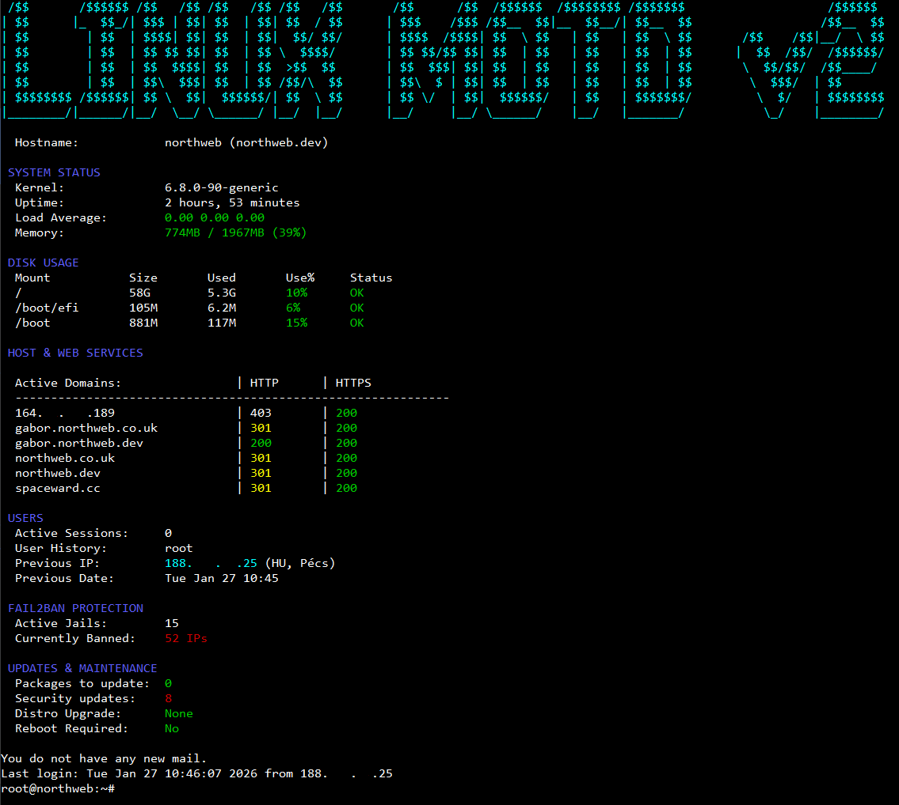
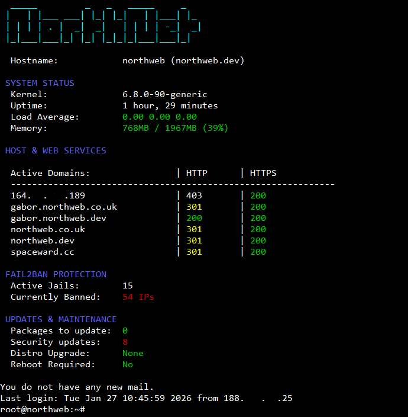

# Linux MOTD v2

A collection of modular shell scripts to generate a dynamic, informative, and colourful Message of the Day (MOTD) upon login for Linux systems (Ubuntu/Debian).

This project replaces the default static MOTD with a real-time system dashboard.

## Default login screen:

## Customized login screen:



## Features

The MOTD is composed of several modular scripts located in `motd-files/`:

*   **Header (`01-header-info`)**: Displays a custom ASCII logo.
*   **System Info (`10-sysinfo`)**: Shows Kernel version, Uptime, CPU Load Average, and Memory Usage with dynamic color coding (Green/Yellow/Red) based on load.
*   **Disk Usage (`20-disk-usage`)**: Lists mounted filesystems with usage percentages. Alerts with colors if usage exceeds 80% or 90%.
*   **Host & Web Services (`30-host`)**:
    *   Displays Hostname and FQDN.
    *   **Auto-discovery**: Scans enabled Apache and Nginx sites.
    *   **Health Check**: Performs a local `curl` check on discovered domains to report HTTP/HTTPS status.
*   **Users & GeoIP (`40-users`)**:
    *   Shows active session count.
    *   Displays the previous login user, IP, and date.
    *   **Geolocation**: Resolves the previous login IP to a City/Country using the `ip-api.com` API.
*   **Security (`50-fail2ban`)**: If `fail2ban` is installed, displays active jails and the total number of currently banned IPs.
*   **Updates (`60-updates`)**:
    *   Lists available package updates (separating security updates).
    *   Checks for distribution release upgrades.
    *   Warns if a system reboot is required.
* **Footer (`99-end`)**: Adds a simple empty line at the end of the MOTD.

## Prerequisites

*   A Linux distribution that uses `/etc/update-motd.d/` (e.g., Ubuntu, Debian).
*   Standard utilities: `curl`, `awk`, `sed`, `grep`.
*   **Optional**: `fail2ban` (for the security module).
*   **Network**: Outbound HTTP access is required for the Geolocation feature (port 80 to `ip-api.com`).

## Installation

1.  Clone the repository:
    ```bash
    git clone https://github.com/gaboreszaki/linux-motd-v2.git
    cd linux-motd-v2
    ```
2.  Make the setup script executable:
    ```bash
    chmod +x setup.sh
    chmod +x update.sh
    chmod +x remove.sh
    ``` 

3. Run the setup script with root privileges:
    ```bash
    sudo ./setup.sh
    ```
    The setup script will run an interactive configuration wizard allowing you to enable or disable specific modules.

    ### ONE LINE SETUP:
    This will clone the repository, make the setup, update, remove scripts executable, and run it with sudo privileges:
    ```bash
        git clone https://github.com/gaboreszaki/linux-motd-v2.git && cd linux-motd-v2 && chmod +x *.sh && sudo ./setup.sh
    ```
    The setup script will:
    - Backup your existing MOTD files to `/etc/update-motd.d.bak/`.
    - Clear the current `/etc/update-motd.d/` directory.
    - Ask you which modules you want to enable.
    - Install the new scripts and configuration.
    - Set executable permissions.

    ### To test immediately without logging out, run:
    ```bash
    sudo run-parts /etc/update-motd.d
    ```
    ### (optional) Adding an alias to your `.bashrc` file:
    If you want to run the `motd` command manually without logging out,
    you can add it as an alias to your `.bashrc` file.

    ```bash
    echo "alias motd='run-parts /etc/update-motd.d'" >> ~/.bashrc && source ~/.bashrc
    ```

## Updating

To update the scripts to the latest version from the repository:

1.  Navigate to the directory:
    ```bash
    cd  ~/linux-motd-v2
    ```
2.  Run the update script:
        ```bash
        sudo ./update.sh
        ```

    This will `git pull` the latest changes and allow you to reconfigure the installed modules.

    ## Uninstallation
    This will remove the installed scripts and restore the backup created during installation.
1.  Navigate to the directory:
    ```bash
    cd  ~/linux-motd-v2
    ```
2.  Run the remove script:
    ```bash
      sudo ./remove.sh
    ```

## Customization
*   **Configuration**: The `setup.sh` and `update.sh` scripts provide an interactive way to enable/disable modules. This configuration is stored in `/etc/update-motd.d/motd.conf`.
*   **Logo**: To add/modify a custom logo run `nano /etc/update-motd.d/logo-custom.txt` and paste your ASCII Art logo.
*   **Colors**: Edit `motd-files/helper.sh` to modify color variables.
*   **Edit the config files**: You can disable specific modules by setting the variable to "n" in `/etc/update-motd.d/motd.conf` 
*   **Manual Module Disabling**:removing the 'execute' permission on the installed file: `sudo chmod -x /etc/update-motd.d/50-fail2ban`
